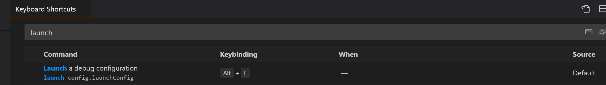
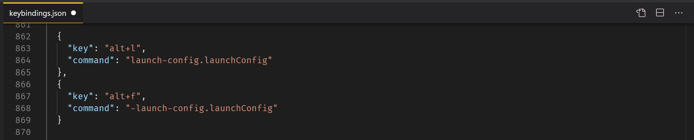

# launch-config


## This vscode extension allows you to create a setting that identifies one of your `launch.json` configurations to run via a keybinding.

-----------------------------------------------------------------------------------------------


## Extension Settings


### This extension contributes two settings:</br></br>

- `launch-config.runLaunchConfiguration`: Identify by `name` which launch.json configuration you would like to run.</br>

```json
"launch-config.runLaunchConfiguration": {
  "name": "Launch File"
}
```


&emsp;&emsp;&emsp;The `name` comes from one of your launch configurations in the `launch.json` file.  For example,

```json    
{
  "name": "Launch File",
  "type": "node",
  "request": "launch",    
  "program": "${file}"
}
```
</br>

- `launch-config.openDebug`: Open the Run/Debug View when running above command. &nbsp;&nbsp;&nbsp;&nbsp;&nbsp;&nbsp;Default = `true`.

```json
"launch-config.openDebug": true,
```

See the note below in `Known Issues` about the `openDebug` setting.
-----------------------------------------------------------------------------------------------


## Keybindings</br>

&emsp;&emsp;&emsp;&emsp;&emsp;&emsp;&emsp;&emsp;&emsp;&emsp;&emsp;&emsp;&emsp;&emsp;&emsp;&emsp;&emsp;&emsp;&emsp;&emsp; DEFAULT KEYBINDING:
</br>



</br>

&emsp;&emsp;&emsp;&emsp;&emsp;&emsp;&emsp;&emsp;&emsp;&emsp;&emsp;&emsp;&emsp;&emsp;&emsp;&emsp;&emsp;&emsp;&emsp;&emsp;&emsp; CUSTOM KEYBINDING:



-------------------------

## TODO

- [&nbsp;&nbsp;] - Add better error notifications: no setting, missing key, no match found.
- [&nbsp;&nbsp;] - Investigate support for more keybindings

-------------------------

## Known Issues

> If you use the `"launch-config.openDebug"` setting (the default is `true`) be aware that the built-in `"debug.openDebug"` setting may prevent it from operating as you expect.  So if you have `"launch-config.openDebug": false` because you do not want the debug view to open when you start a debug session with this extension but you have also have `"debug.openDebug": "openOnSessionStart"` that setting will always open a the debug view regardless of this extension's settings.

> If you want  `"launch-config.openDebug` to always work as you expect, I recommend setting `"debug.openDebug": "neverOpen"`.  Then `"launch-config.openDebug": true` will always open the debug view and `"launch-config.openDebug": false` will never open a debug view.

</br>

------------------------

## Release Notes

&emsp;&emsp;&emsp;0.0.1  Initial release of `launch-config` extension

&emsp;&emsp;&emsp;0.0.2  Added readme file and images


</br>