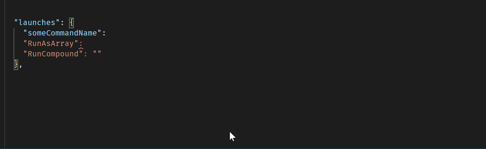
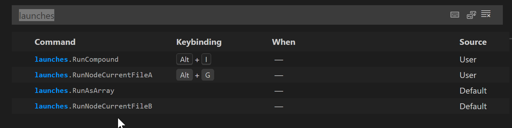
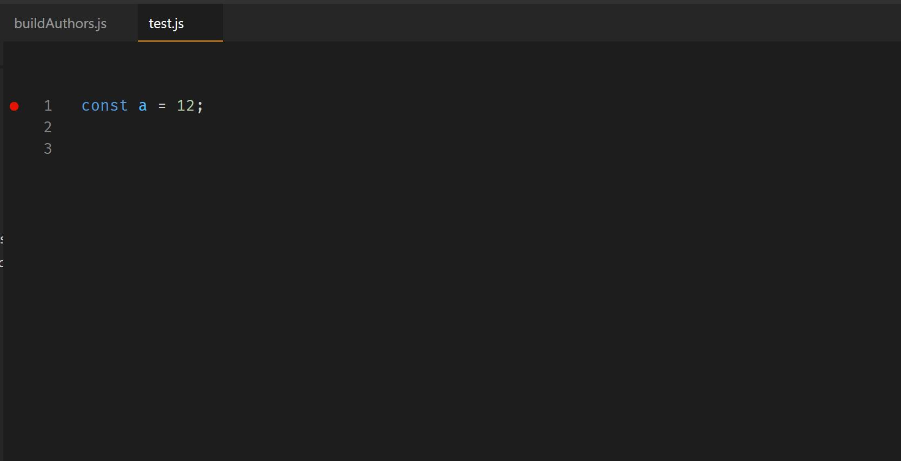
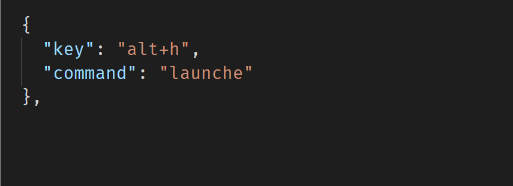

# Launch Configs

 This vscode extension allows you to create settings to launch any number of your `launch.json` configurations or compound configurations via separate keybindings.  These launch configs can be in any root folder in a multi-root workspace.  And a launch config from one root folder can be triggered while in a file from a different root folder.  And you can create arrays of launch configs to run with a single keybinding.</br></br>

[From [startDebugging()](https://code.visualstudio.com/api/references/vscode-api#debug)  documentation.] ::  
> The named configurations are looked up in `.vscode/launch.json` found in the given folder. Before debugging starts, all unsaved files are saved and the launch configurations are brought up-to-date. Folder specific variables used in the configuration (e.g. `${workspaceFolder}`) are resolved against the given folder.   

The above caution has been modified by a later update to vscode (v1.54).  Now you can explicitly set vscode to *not* save any unsaved files prior to debugging:    

```jsonc
// Controls what editors to save before starting a debug session.  

// allEditorsInActiveGroup: Save all editors in the active group before starting a debug session.  
// nonUntitledEditorsInActiveGroup: Save all editors in the active group except untitled ones before starting a debug session.  
// none: Don't save any editors before starting a debug session.  

"debug.saveBeforeStart": "allEditorsInActiveGroup", 
```
 

</br>

So be careful, if you use this extension to start a launch configuration from a workspace folder different than that of the **active editor**, note that vscode's built-in folder-specific variables, like  `${workspaceFolder}`, will be resolved to the folder that you are calling into, **but** variables like `${file}` in that same launch configuration will be resolved to the active text editor at the time of triggering the command - which may not even  be in that same workspaceFolder.  This may not be what you expect.

</br>

Prior to v0.7.0, if you had started a debug session with a keybinding, and then re-triggered the same keybinding, it would fail and you would get a warning notification from vscode about attempting to start an already running launch configuration.  With v0.7.0 this has been reworked so that you have more control over an already running debug session.  Now you can choose to stop it, stop and then start it, start or restart it either through a setting which controls the handling of all currently running debug sessions or through a keybinding argument for that specific debug session.

For more on this new functionality, see **[session options](options.md)**.

-----------------------------

### Features

* Shortcuts for launch configurations, in `settings.json`
* Run any launch configuration found in any multi-root folder in a workspace, in `settings.json`  
```jsonc
  "launches": {
    "RunNodeCurrentFile": "Serve File (Project A Folder)",
    "RunNodeCurrentFileB": "Launch File (Project B Folder)"
  }
``` 
 In keybindings.json or added from the Keyboard Shortcuts UI: 
```jsonc
  {
    "key": "alt+g",               <== whatever keybinding you wish    
    "command": "launches.RunNodeCurrentFile",
    "arg": "restart"              <== optional, see the session options
  }
```
 
Trigger from a Project A or Project B editor:  
```jsonc
  {
    "key": "alt+h",                       
    "command": "launches.RunNodeBuildFileA"
  },
  {
    "key": "alt+i",                       
    "command": "launches.RunNodeBuildFileB"
  }
```
* Run an array of launch configurations from any `launch.json` in the workspace, in `settings.json`:
```jsonc
  "launches": {
    "RunLaunchArray": ["Launch File (Project A)", "Launch File (Project B)"]
  }
```
```jsonc
  {
    "key": "alt+j",
    "command": "launches.RunLaunchArray"
  }
  ```
  * Open a QuickPick panel of all available launch configurations.  Select and run one or many from this list.

-----------------------------------------------------------------------------------------------


## Extension Settings
 

### This extension contributes two settings:</br>

1. **launches** (an object of key : value pairs): Identify by using your `launch.json` `name` which configuration you would like to run.  You can use `"compounds"` configurations as well.</br>

The first part of each entry, like `"RunNodeFile"`, can be anything you want (without spaces) - you will use it in the keybinding.  The second part, like `"Launch File"`, is the name of the configuration you would like to run. In `settings.json`:

```jsonc
  "launches": {

    "RunNodeFile": "Launch File (<some workspaceFolder name>)",  // the folder name will be provided for you
    "RunCompound1": "Launch file and start chrome"               // but you do not need to have a folder name
  },
```

You will get intellisense in your `settings.json` for the 'name' of all possible launch configurations or compound configurations.  This intellisense will include all configurations and root folder names if you are in a multi-root workspace.  That folder name is used to resolve which `launch.js` to look in for the corresponding configuration (especially important where the same config `name` - like `Launch File` - is used in multiple `launch.json` files).


<!--  -->


</br>
</br>[The launch config `name`s can be anything - I just happened to use "Launch" at the beginning of all these demo names, that is not necessary.]</br></br>

Although intellisense will automatically append the folder name, you do not need to use one.  If it is absent then the `activeEditorWorkSpace` will be used; so only the current workspaceFolder `launch.json` will be examined.

The `name` key and value can be anywhere within its configuration - it does not need to be first. An example `launch.json` file:

```json
{
  "version": "0.2.0",
  "compounds": [
    {
      "name": "Launch file and start chrome",
      "configurations": ["Launch File", "Launch Chrome against localhost"],
      "preLaunchTask": "Start server",
      "stopAll": true
    }
  ],
  "configurations": [
    {
      "type": "node",
      "request": "launch",
      "name": "Launch File",
      "program": "${file}"
    },
    {
      "type": "chrome",
      "request": "launch",
      "name": "Launch Chrome against localhost",
      "url": "http://localhost:8080",
      "webRoot": "${workspaceRoot}",
      "file": "${workspaceRoot}/build.html"
    }
  ]
}
```
</br>

2.  **launch-config.ifDebugSessionRunning** : Options: `"stop/start"`, `"stop"` (the default), `"restart"` or `start` 

This setting controls how to handle a currently running debug session when triggering the same keybinding again for that launch configuration.   See more at **[session options](options.md)**.   


<br />


-----------------------------------------------------------------------------------------------


## Commands and Keybindings</br>

This extension generates commands from settings created by the user. These generated commands will appear in `Keyboard Shortcuts` and keybindings can be assigned there or manually, with intellisense, in `keybindings.json`.  In this example there are four settings from which commands have been generated and two of those have had keybindings associated with them previously.


<!--  -->


This extension also provides one built-in command `launches.showAllLaunchConfigs` which opens a QuickPick panel of all available launch configurations.  From this panel you can select and run one or more configurations.  Note: there is no guarantee that the configs will be run in the order you select them as just an alphabetical list of selections is returned by vscode.

<!--  -->


</br></br>
### Keybindings:

Choose whatever different keybindings you wish.  Here are example keybindings (in `keybindings.json`):

```jsonc
  {
    "key": "alt+f",
    "command": "launches.RunAsArray"
    // "when": "editorTextFocus && editorLangId == javascript"  // for example
  },
  {
    "key": "alt+g",
    "command": "launches.RunCompound",
    "args": "restart"     // see Note below on using args in a keybinding
  },
  {
    "key": "alt+k",
    "command": "launches.showAllLaunchConfigs"  // open the QuickPick with available configs
  },
  ```

  You will get intellisense in your `keybindings.json` file for the `launches.showAllLaunchConfigs` command and upon typing the `"launches."` part of the command.  Then you will see a list of your available completions from your `settings.json`, such as `RunAsArray` and `RunCompound`.

  * Note: see **[session options](options.md)** for more on using args in a keybinding.


<!--  -->


-------------------------

## Known Issues

1.  The `restart` option does not work when re-launching a browser.  Example:

```jsonc
  {
    "type": "chrome",
    "request": "launch",
    "name": "Launch Chrome against localhost",
    "url": "http://localhost:8081",
    "file": "${workspaceFolder}/build.html"
  }
  ```

  The browser will not successfully restart the **second time** - **use the `stop/start` option instead** when launching browsers.

2. Similar to Issue 1, the `restart` option does not work when restarting a compound configuration from your `launch.json` file(s).  From the `launch.json` example above:

```jsonc
  "compounds": [
    {
      "name": "Launch file and start chrome",
      "configurations": ["Launch File1", "Launch File2"],
      "preLaunchTask": "Start server",
      "stopAll": true
    }
  ],
  ```

  When vscode starts this the first time, each debug session has a separate name and `id`, like `Launch File1`, but **no compound name or compopund id**, here the name would be `Launch file and start chrome`.  This is a problem because the `workbench.action.debug.restart` requires a session.id to know which debugging session to restart.  But there is no session.id that represents the compound configuration as a whole.

  So this extension will simply stop and start the compound configuration, but not "restart" it (in some situations there is a difference).  `stop/start` works as an option; the `restart` option will do the same thing as `stop/start`.  

3. For some reason, when you start multiple debug sessions and switch between them with the debug toolbar, vscode will not always show the arrow for `Continue` but stay with `Pause` - you can get it to show the `Continue` arrow by clicking on the Debug Call Stack session (the top entry for each debug session with the *bug* icon).  This seems to be related to this [issue](https://github.com/microsoft/vscode/issues/114914) and appears to be resolved in the Insiders' Build v1.54.

<br/>


<br/><br/>
  

4.  In a multi-root workspace you can create launch configurations and compounds in a `*.code-workspace` file.  This extension is able to retrieve those but **cannot** scope a debugging session to that file.  Thus launch configurations in a `*.code-workspace` can not be used with this extension.  `vscode.debug.startDebugging(workspaceFolder|undefined, name|Configuration)` needs to be scoped to a workspaceFolder.

5.  There is an unusual bug in vscode that pertains only to multi-root workspaces where you have at least two `launch.json` files with identically-named configurations that are used in a compound configuration.  So if you have this in *projectA's* `launch.json`:

```jsonc

"compounds": [
      {
          "name": "Launch file and start chrome",
                                            // what if no "Launch File" config in file?
          "configurations": ["Launch File", "Launch Chrome against localhost" ],
          "stopAll": true 
      },
    ],
```

but assume there is actually **no** `Launch File` config in that file (*projectA*).  If there should happen to be a `Launch File` config in *projectB's* `launch.json` that *projectB* `Launch File` will be started by vscode.  That should not happen when the `startDebugging()` command is scoped to *projectA* - that debug call should fail and not look for another identically-named config somewhere in the multi-root workspace.

Of course, you shouldn't have a compound config that lists a configuration that doesn't exist in that same file - that is an error.  So this bug should be easily avoided.

-----------------------


## TODO

[ X ] - Add support for multiple workspaceFolders, finished in v0.4.  
[ X ] - Explore running multiple debug sessions from one keybinding [v0.4].  
[ X ] - Provide intellisense for settings.json, with all `"names"` fron launch.json  [v0.3].  
[ X ] - Provide intellisense for `launches.` commands in keybindings.json from settings.json keys  [v0.2].    
[ X ] - Add command and QuickPanel launch config and selections [v0.5].  
[ X ] - Add support for stopping, restarting or stop/start a previously running debug session  [v0.7.0].  
[&emsp; ] - Explore retrieval of launch configs from `.code-workspace` files in a multi-root workspace.  
[&emsp; ] - Explore support for task arguments.  
[&emsp; ] - Explore generating a command directly from keybindings.  
[ X ] - Provide intellisense for `args` in `keybindings.json` [v0.7.1].  
[ X ] - Explore whether compound configuration handling can be stream-lined.   
[ X ] - Explore whether other compound arguments like `prelaunchTask` and `presentation` can be retrieved on restarts.


-------------------------

## Thank you

For the addition of the ability to bind any number of launch configurations to keybindings, I relied heavily on the code from [Jeff Hykin and macro-commander](https://marketplace.visualstudio.com/items?itemName=jeff-hykin.macro-commander).

For determining the workspaceFolder of the current file, I used code from [rioj7's command-variable](https://github.com/rioj7/command-variable/tree/39ff184e2c32e01e8dd429a796568b2ef6617d32).

For helping getting Intellisense working in keybindings.json for `launches.` commands, see [rioj7's answer](https://stackoverflow.com/a/64593598/836330).  

For debugging [DJ4ddi: issue 1](https://github.com/ArturoDent/launch-config/issues/1) and filing Github issue [Restart specific debugger using command](https://github.com/microsoft/vscode/issues/114467) that enabled the use of `vscode.commands.executeCommand('workbench.action.debug.restart')` with arguments.  

-------------------------

## Release Notes

* 0.0.1 &emsp;  Initial release of `launch-config` extension
.
* 0.0.2 &emsp;  Added readme file and images.

* 0.0.3 &emsp;  Switched to `vscode.debug.startDebugging()` - much simpler.

* 0.0.4  &emsp; **BREAKING CHANGE** Added ability to bind any number of launch configs.

* 0.1.0 &emsp;  Added preliminary support for multiple workspaceFolders.

* 0.2.0 &emsp;  Added Intellisense in keybindings.json commands.

* 0.3.0 &emsp;  Added Intellisense in settings.json for launch configuration/compound 'name'.

* 0.4.0 &emsp;  More on using multi-root workspaces with multiple `launch.json` files.    
&emsp;&emsp; &emsp; Added the ability to run an array of launch configs from a single command.  
&emsp;&emsp; &emsp; Intellisense for array commands like `"RunAsArray": ["Launch Build.js (BuildSACC)", "Launch Build.js2 (TestMultiRoot)"]`.

* 0.5.0 &emsp;  Added command to show a QuickPick panel of all available launch configs, and select therefrom.

* 0.6.0 &emsp; Fixed so intellisense is only within the 'launches' setting, not triggered in other unrelated settings. 

* 0.7.0 &emsp; Added `launch-config.ifDebugSessionRunning` setting to stop, restart or stop/start a running debug session.  
&emsp;&emsp; &emsp; Added support for an argument in keybindings for individual debug session control.  
&emsp;&emsp; &emsp; Added more support for settings with no workspaceFolder name.  
&emsp;&emsp; &emsp; Fixed using keybinding args for compound configurations.  
* &emsp;&emsp; &emsp; 0.7.1 &emsp; Added intellisense support in keybindings `args`.


 


</br>